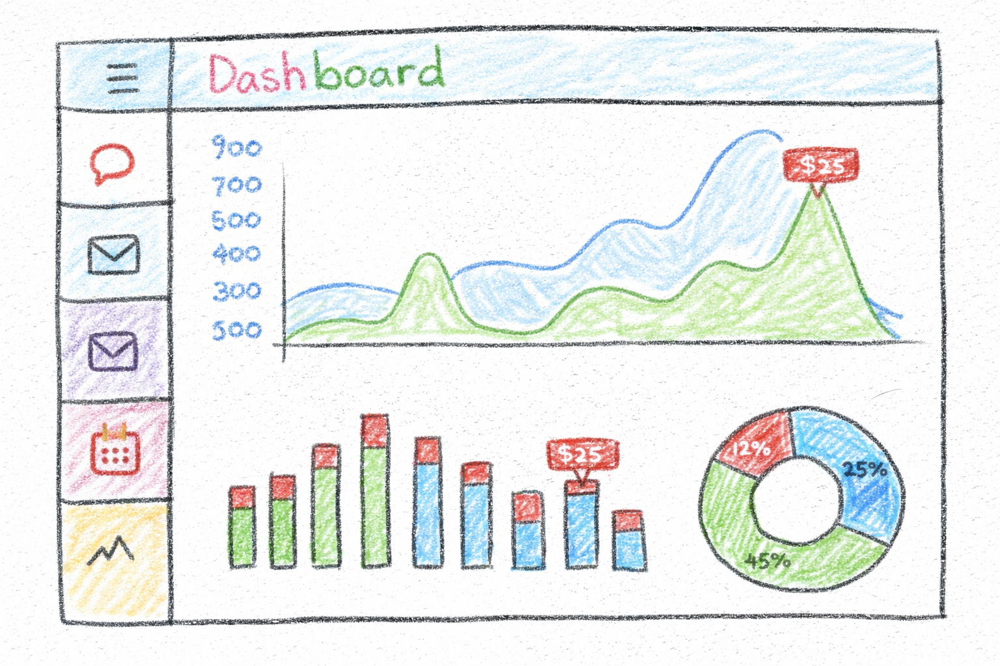

# Classic Models Sales - KPI Report


<p align="center">
  
</p>


## Project Background

As a professional Data Scientist, the development of an executive dashboard provides the strategic bridge between raw data processing and high-level decision-making. For Toys & Models Co., I developed an enterprise-grade interactive dashboard to provide actionable insights into sales performance, customer behavior, and operational risks. **This dashboard analyzes 283 orders placed between 2018 and February 2020 across North America, Europe, and Asia-Pacific, covering 98 active customers, 110 products, and an organization of 23 employees (17 sales reps) in 7 offices**. The goal was to transform raw transactional data into strategic insights that drive decision-making for executives, sales managers, and business stakeholders.

> **Data note:** the database is a curated *subset* of the canonical *classicmodels* schema. All figures below are verified directly against this database (see the SQL portfolio in [SQL-Queries](https://github.com/aalopez76/SQL-Queries)); do not assume the canonical totals.

````Markdown
```
Raw Tables (SQLite)          SQL Analytics Layer              Dashboard Layer
─────────────────            ───────────────────              ───────────────
┌─────────────┐              ┌──────────────┐               ┌──────────────┐
│ customers   │──┐           │ Descriptive  │──┐            │ Executive    │
│ orders      │  │           │ (What?)      │  │            │ View         │
│ orderdetails│  ├─────────▶│              │  │            ├──────────────┤
│ products    │  │           │ Analytical   │  │            │ Regional     │
│ employees   │  │           │ (Why?)       │  ├──────────▶│ View         │
│ payments    │  │           │              │  │            ├──────────────┤
│ offices     │  │           │ Diagnostic   │  │            │ Risks &      │
│ productlines│──┘           │ (What wrong?)│  │            │ Diagnostics  │
└─────────────┘              │              │  │            ├──────────────┤
                             │ Predictive   │  │            │ Opportunities│
                             │ (What next?) │──┘            ├──────────────┤
                             └──────────────┘               │ Deep Dive    │
                                                            └──────────────┘
```
````

The analysis leverages a **multi-layer SQL analytics framework** (descriptive, analytical, diagnostic, and predictive) combined with **Vizro's modern visualization capabilities** to deliver real-time KPIs, risk detection, and growth opportunities.

### **Dashboard Key Features**
- **Real-Time KPIs**: 5 executive cards with YoY % change calculations
- **Interactive Filters**: Click-to-filter maps, radio button selectors, dropdown menus
- **Advanced Tables**: AG Grid with conditional formatting (ABC highlighting, status indicators, emoji lift scores)
- **Responsive Design**: Dark theme, mobile-compatible layouts
- **Modular Architecture**: Git submodules for SQL queries and database connectors

---

## Executive Summary

This dashboard provides comprehensive insights across five key areas: executive KPIs, regional performance, risk diagnostics, growth opportunities, and deep-dive analytics. The analysis reveals **moderate revenue concentration** among top customers and products, **geographic imbalance** in sales distribution, and **predictable demand patterns** ideal for forecasting. Key findings include **credit-misalignment risk of ~$3.05M** flagged across high-risk customers, **payment coverage of 94.7% by amount**, and **1,367 cross-sell product pairs** surfaced for bundling opportunities.

---

## Insights Deep-Dive

[](https://huggingface.co/spaces/aalpzp/Executive_KPI_Dashboard)


### **Customer & Geographic Performance**
- **98 active customers** (122 registered) distributed across 22 countries, with significant concentration in North America and Western Europe.
- **Top 20% of customers generate ~39% of revenue** (ABC segmentation) — a meaningful but moderate concentration, not an extreme Pareto.
- **Geographic concentration**: USA, Spain, and France account for **~55% of total sales** (USA alone 34.7%), while many countries contribute under 1% each.
- **Sales-rep coverage**: a subset of customers have no assigned sales rep (all with a 0 credit limit) — a valid optional gap rather than a data error.

### **Product Portfolio Analysis**
- **110 SKUs** across 7 product lines (Classic Cars, Motorcycles, Planes, Ships, Trains, Trucks & Buses, Vintage Cars).
- **Top 10 products drive ~18% of revenue**; it takes ~47 SKUs to reach 60% — i.e. revenue is *spread*, not dominated by a few.
- **Classic Cars** lead with **40.5%** of sales, followed by **Vintage Cars (18.9%)** and **Motorcycles (11.2%)**.
- **Cross-sell analysis** surfaces **1,367 product pairs** (co-occurrence, support, confidence) for market-basket bundling.

### **Operational Quality & Risk Management**
- **High-risk customers identified**: **58 accounts** with credit/sales misalignment.
- **Amount at risk**: **~$3.05M** across those high-risk customers.
- **Credit policy gaps** (misalignment review): **1 over-credited** and **2 under-credited** accounts.
- **Referential integrity**: 0 orphan rows across the foreign keys (100% FK match) — the dataset is structurally sound.
- **Data quality**: **2.9% of rows** excluded from KPIs due to invalid date fields (orderDate/shippedDate/requiredDate).

### **Predictive Insights & Forecasting**
- **RFM customer segmentation** (122 scored customers): **Top ~25%**, **High ~20%**, **Mid ~23%**, **Low ~32%**.
- **Next-order prediction**: average reorder interval is **~204 days**; the dataset ends in **Feb 2020**, so recency-based churn signals are pronounced.
- **Demand seasonality**: monthly lag/lead features highlight recurring Q4 peaks, useful for inventory planning.
- **Payment coverage**: **94.7% by amount** — most invoiced revenue is collected.

### **Sales Organization Performance**
- **23 employees** (17 sales reps) across **7 offices** spanning North America, Europe, and Asia-Pacific.
- **Uneven workload distribution** across reps — an opportunity to rebalance portfolios.
- **Territory coverage**: several countries are served without a dedicated local rep, relying on remote management.

---

## Recommendations

Based on the findings, I recommend the following actions:

1. **Diversify the customer & geographic base**: target under-represented countries to reduce the ~55% top-3 concentration.
2. **Rebalance sales portfolios**: even out customers-per-rep to improve relationship quality and workload balance.
3. **Tighten credit policy**: review the 58 high-risk accounts (~$3.05M at risk) and the over/under-credited cases (1/2).
4. **Reduce churn risk**: prioritize outreach to customers well past their ~204-day reorder interval (recency-based).
5. **Leverage cross-sell**: promote high-confidence pairs from the 1,367 surfaced product pairs to top-RFM customers.
6. **Automate data-quality checks**: keep the FK/null integrity checks in CI to prevent the ~2.9% date-quality loss from growing.

---

### **Git Submodules**
This project uses 2 external repositories:
1. **[SQL-Queries](https://github.com/aalopez76/SQL-Queries)**: 39 production-grade SQL queries (descriptive, diagnostic, analytical, predictive, structural layers)
2. **[SQL-Connection-Module](https://github.com/aalopez76/SQL-Connection-Module)**: Multi-engine database connector (SQLite, PostgreSQL, MySQL, etc.), used by the dashboard's data engine

---

> Figures verified against the database on 2026-06-04. QA assisted by AI tooling.
